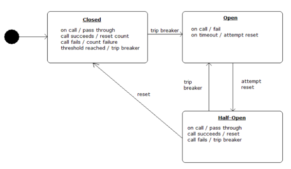
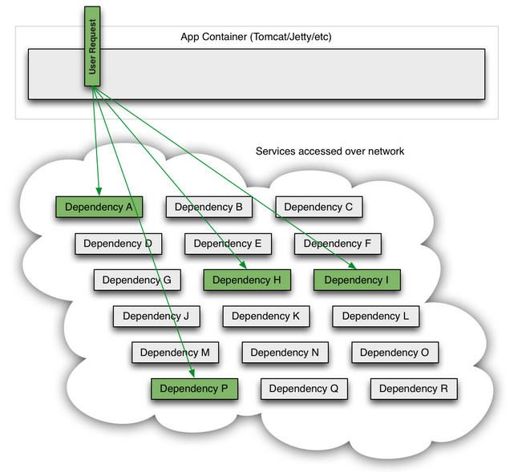

# 熔断器

断路器可以防止一个应用程序多次试图执行一个操作，即很可能失败，允许它继续而不等待故障恢复或者浪费 CPU 周期，而它确定该故障是持久的。

断路器模式也使应用程序能够检测故障是否已经解决。如果问题似乎已经得到纠正，应用程序可以尝试调用操作。

断路器增加了稳定性和灵活性，以一个系统，提供稳定性，而系统从故障中恢复，并尽量减少此故障的对性能的影响。它可以帮助快速地拒绝对一个操作，即很可能失败，而不是等待操作超时（或者不返回）的请求，以保持系统的响应时间。如果断路器提高每次改变状态的时间的事件，该信息可以被用来监测由断路器保护系统的部件的健康状况，或以提醒管理员当断路器跳闸，以在打开状态。

流程图：

